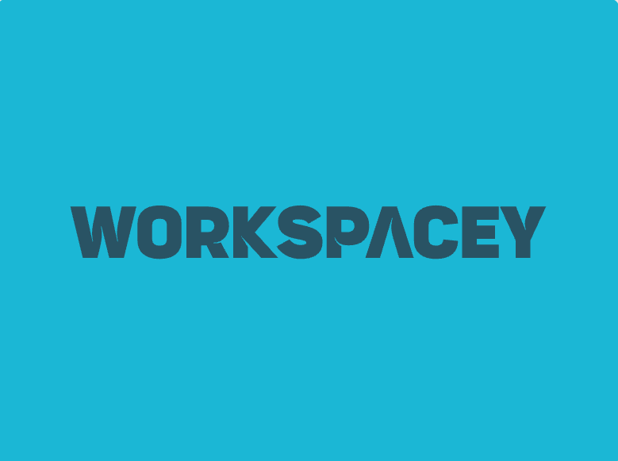

<H1 align="center">
 WorkSpacey 💼
</H1>

  

Elevate your team's efficiency with WorkSpacey, a cutting-edge Discord bot that transforms your server into a productivity powerhouse! 💼✨

## 🌟 Unleash Your Team's Potential

WorkSpacey isn't just a bot; it's your personal productivity coach, time manager, and team coordinator all rolled into one sleek package. Here's how it revolutionizes your workflow:

### 🕰️ Work Session Wizardry
- `/logon`: Kickstart your productivity journey with a single command
- `/logoff`: Wrap up your day with a satisfying summary of achievements
- 🔔 Smart break reminders keep you refreshed and focused

### ☕ Break Time Bliss
- `/startbreak`: Take a well-deserved breather without losing track
- `/endbreak`: Dive back into work, recharged and ready to conquer
- ⏰ Long break alerts ensure you don't lose sight of the big picture

### 🎙️ Voice Channel Virtuoso
- Never miss a beat with timely reminders to join voice chats
- Seamlessly tracks your team's presence for optimal collaboration

### 👥 Team Synergy Supercharger
- `/status`: Get a bird's-eye view of your team's activities
- `/work_summary`: Instantly aligned with everyone's focus areas

### 📅 Meeting Maestro
- `/meeting_schedule`: Coordinate like a pro with custom meeting setups
- 📧 Automatic DM notifications keep everyone in the loop

### 🆘 Help at Your Fingertips
- `/help`: Your go-to guide for unleashing WorkSpacey's full potential

## 💡 Showcasing Technical Brilliance

WorkSpacey isn't just about features; it's a testament to advanced coding prowess:

1. **🔄 Asynchronous Mastery**: Harnessing the power of asyncio for seamless multitasking
2. **🔌 API Sorcery**: Flawless integration with Discord's ecosystem
3. **🌐 Time Zone Tamer**: Precision scheduling across global teams
4. **🧠 Data Structure Dynamo**: Optimized information management for lightning-fast responses
5. **🛡️ Error-Handling Hero**: Unshakeable stability in the face of challenges
6. **🔐 Security Sentinel**: Fort Knox-level protection for sensitive data
7. **🔍 Regex Virtuoso**: Parsing user inputs with the finesse of a language expert
8. **⚙️ Automation Ace**: Set-it-and-forget-it tasks that keep your team on track
9. **🎨 UX Maestro**: Intuitive commands that feel like second nature
10. **🏗️ Code Architecture Aficionado**: A foundation so solid, it's ready for anything

## 🚀 Blast Off in 3... 2... 1...

Get WorkSpacey up and running in no time:

1. 📥 Clone this cosmic repository
2. 🔧 Install the galactic dependencies:

